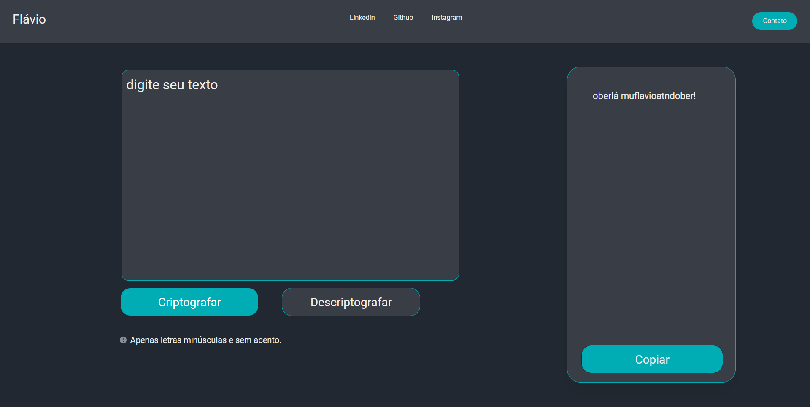

# ONE - Decodificador de texto

Desenvolvido de forma individual, o projeto Decodificador de texto foi um dos desafios propostos durante o programa ONE da Oracle.
Com este aplicativo, é possível criptografar e descriptografar mensagens digitadas pelo usuário. O projeto foi desenvolvido de forma simples, utilizando apenas HTML, CSS e JavaScript, tornando-o acessível e fácil de usar. A interface amigável e intuitiva permite que o usuário proteja suas mensagens confidenciais com facilidade.

## 🚀 Demonstração

[Clique aqui](https://flaviomattosdev.github.io/ONE-Decodificador-de-Texto/) para acessar o resultado final do projeto.

## 🛠️ Tecnologias Utilizadas

* [HTML](https://developer.mozilla.org/pt-BR/docs/Web/HTML) - Linguagem de Marcação
* [CSS](https://developer.mozilla.org/pt-BR/docs/Web/CSS) - Linguagem de Estilização
* [Javascript](https://developer.mozilla.org/pt-BR/docs/Web/JavaScript) - Linguagem de Programação

## 👨‍💻 Desenvolvedor

    
    
&nbsp&nbsp&nbspFlávio Mattos 
    &nbsp&nbsp&nbsp<a href="https://www.instagram.com/fflaviomattos/">Instagram</a>&nbsp;|&nbsp;<a href="https://github.com/FlavioMattosDev">GitHub</a>&nbsp;|&nbsp;<a href="https://www.linkedin.com/in/flavio-mattos/">LinkedIn</a>&nbsp;

  

---
